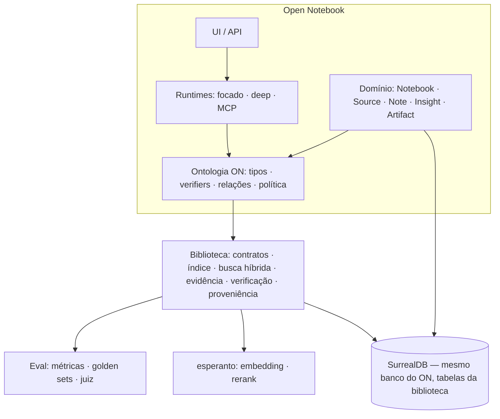

# Biblioteca de Retrieval & Evidências — Requisitos

> **Status:** rascunho para o kickoff · setembro de 2026
> **Perspectiva desta versão:** Open Notebook como Consumidor 2. A rodada seguinte enriquece com nord-wealth-ai (doador), nord-experiments (doador), smartfit-intelligence (Consumidor 1) e as peças menores.
> **Documentos de origem:** "Uma espinha dorsal de retrieval" (análise do portfólio, Gyovana & Luis, ago/2026) e a visão Evidence-Centered Research do Open Notebook (drafts internos, jul/2026).

---

## 0. Por que esta biblioteca existe

O portfólio mostra o mesmo conhecimento sendo descoberto e perdido várias vezes: nenhuma das implementações vetoriais tem índice, só um projeto valida que uma citação corresponde a algo real, os sistemas em produção destroem a identidade do chunk ao reprocessar, e cinco harnesses de avaliação foram construídos sem conversar entre si.

A visão do Open Notebook chegou ao mesmo desenho por outro caminho: um *Research Kernel* headless, independente de agentes, com contrato de evidências verificáveis servindo modo focado, deep agent e MCP. As três projeções de texto que ele separou (unidade de retrieval / passagem de contexto / span de citação) são exatamente as três projeções que o portfólio pede.

A biblioteca é a materialização desse ponto de encontro. O padrão já foi validado cinco vezes na casa — esperanto, ai-prompter, content-core, surreal-commands, podcast-creator — e a condição que fez esses casos darem certo está satisfeita: existe um doador vivo em produção e consumidores explicitamente bloqueados pela peça.

**Tese em uma frase:** uma biblioteca não te poupa de escrever código; te poupa de errar cinco vezes a mesma coisa.

---

## 1. Papéis

| Projeto | Papel | Doa | Recebe |
|---|---|---|---|
| nord-wealth-ai | Doador | ~1.800 linhas de retrieval genérico, fusão híbrida, guard de drift de embedding, rubrica e RAG triad | índice vetorial, validação de citação, recall@k |
| nord-experiments | Doador | métricas de retrieval, golden dataset em três estágios, conhecimento de configuração por provider | deixar de ser um repo sem commits |
| smartfit-intelligence | Consumidor 1 | o melhor contrato de evidência do portfólio: guardrails retry-then-mark, IDs determinísticos por tupla semântica | a camada de retrieval inteira |
| **open-notebook** | **Consumidor 2** | **o vocabulário: scope, candidato, evidência, proveniência, política de elegibilidade** | **busca híbrida com escopo, citação estruturada, índice vetorial, eval — as Etapas 1 e 2 da visão** |
| adaptive-learning | Contraprova | demonstra que grafo + IRT resolve sem retrieval | nada — a biblioteca não pode ser obrigatória |

O Open Notebook **não é doador de código**. O que ele doa é o modelo conceitual, e o que ele exige é que esse modelo caiba na biblioteca sem se tornar premissa dela.

---

## 2. O Open Notebook hoje (o que a biblioteca substitui)

Estado verificado no código em 2026-09-02:

| Aspecto | Hoje | Consequência |
|---|---|---|
| Unidade indexada | `source_embedding`: chunk de ~400 tokens (`OPEN_NOTEBOOK_CHUNK_SIZE`), campo `order`, `content`, `embedding` | chunk é premissa, não parâmetro |
| Identidade do chunk | id do registro; reprocessar = `DELETE source_embedding WHERE source = $id` + reinserir | **identidade morre no re-embedding**; nenhuma citação sobrevive a reprocessamento |
| Outras unidades | `source_insight` (derivado por LLM, tem `embedding` opcional), `note` (autoral, `embedding` opcional), `source.full_text` (só BM25) | três tabelas, três caminhos, sem contrato comum |
| Busca textual | `fn::text_search` (BM25, analyzer único, highlights) sobre source title/full_text, chunks, insights, notes | funciona sem embeddings — é o fallback que a comunidade local-first depende |
| Busca vetorial | `fn::vector_search` com `$min_similarity`; **full scan**, sem índice HNSW/MTREE | não escala para #1154 (centenas/milhares de sources) |
| Híbrida | **não existe** — texto *ou* vetor, exclusivos; fallback de texto→vetor só em erro de `position overflow` (#648) | #1036 é pedido da comunidade |
| Escopo | flags `source: bool, note: bool`; sem filtro por notebook | #574 é pedido da comunidade |
| Citações | convenção textual no prompt; nenhuma validação de que o id citado foi entregue ao modelo | #294; a promessa de verificabilidade não é garantida pelo sistema |
| Ask (global) | grafo LangGraph: LLM gera até 5 buscas → `vector_search` por termo → respostas parciais → resposta final | runtime separado, sem evidência estruturada |
| Notebook chat | contexto inteiro (full/insights/excluded por source), montado no cliente e devolvido ao servidor | não há retrieval no chat; #473, #427 |
| Proveniência | `refers_to`/`reference` (organizacional), `source_insight.source`, `note` sem relação com evidências | não dá para caminhar de um derivado até a passagem original |
| Avaliação | nenhuma | melhorias não têm régua |

Tudo na coluna "Hoje" que é busca, índice, fusão, validação e avaliação sai do Open Notebook e passa a vir da biblioteca. O que é domínio (Source, Note, Insight, Notebook, adoção) fica.

---

## 3. Casos de uso do Open Notebook que a biblioteca precisa servir

Numerados para rastreabilidade nos requisitos.

- **U1 — Auto context no Notebook chat.** Dada a pergunta e a conversa, recuperar só o relevante dentro do escopo do notebook, respeitando um orçamento de tokens, e entregar um `EvidenceBundle` que o runtime focado transforma em prompt. Server-side. Funciona sem tool calling. Degrada para texto puro sem embeddings.
- **U2 — Source chat.** Escopo = uma source. Quando cabe no contexto, full text; quando não cabe, retrieval dentro da source. Mesmo contrato, escopo menor.
- **U3 — Ask / pesquisa global.** Escopo = todos os notebooks (ou um conjunto). Várias buscas por investigação; o runtime (hoje o grafo Ask, amanhã o deep agent) consome candidatos, abre evidências, valida claims.
- **U4 — Busca humana.** Híbrida por padrão; texto/vetor como opções avançadas; filtros por notebook, tipo de unidade e source; resultados com preview e locator para o humano abrir.
- **U5 — Citações estruturadas.** O modelo devolve `{claim, evidence_ids}`; o backend verifica que cada evidence_id foi entregue àquela geração *e* que o trecho corresponde à fonte; a UI renderiza com locator. Falha é marcada, não descartada.
- **U6 — Breadcrumbs.** Um insight, uma note ou um artifact encontrado na busca deve levar à passagem original quando ela existir: seguir `derived_from`/`generated_from`, buscar nas sources relacionadas, devolver breadcrumb + evidência primária.
- **U7 — Conteúdo gerado pesquisável.** Todo artifact (study guide, flashcards, podcast, mind map…) produz suas unidades de retrieval e preserva o bundle de evidências que participou da geração. Encontrável; nunca evidência factual por default.
- **U8 — Evidência externa não adotada.** Resultado de busca web ou de biblioteca conectada (Zotero, Obsidian, filesystem) pode ser usado e citado com um receipt mínimo (URI, título, trecho, provider, data, hash) sem ingestão; o usuário decide adotar como Source.
- **U9 — Ferramentas para agentes.** `search_knowledge` (candidatos compactos, não citáveis) → `read_evidence` (receipts citáveis) → `validate_claims` (relatório). Mesmas funções para o grafo focado, o deep agent e o servidor MCP. Sem dependência de framework.
- **U10 — Local-first.** Modelos pequenos, sem tool calling, sem embeddings, máquina modesta: tudo acima continua funcionando em modo degradado e previsível.
- **U11 — Avaliação.** Um conjunto pequeno de perguntas reais (lookup exato, semântica, comparação, cross-documento, global, sem resposta, citação correta/incorreta) rodando na mesma régua que os outros consumidores.
- **U12 — Escala.** Notebooks com centenas ou milhares de sources (#1154): índice vetorial real, filtros antes do ranking, sem full scan.

---

## 4. A ontologia que o Open Notebook declara

A biblioteca não define entidades; o consumidor publica uma **camada de ontologia** que declara os tipos de unidade, como se verificam, como se relacionam e a política de elegibilidade. Esta é a do Open Notebook.

### 4.1 Tipos de unidade

| Tipo | Natureza epistêmica | `text_for_embedding` | `text_for_context` | `locator` | Verifier |
|---|---|---|---|---|---|
| **Passage** (chunk de Source) | extrato — fatia literal do original | o chunk (talvez enriquecido) | chunk + vizinhos | source, trecho exato, ordem, heading | `QuoteMatch` |
| **Section / Document summary** (fase 2) | derivado | resumo | resumo | source, faixa | `DerivationIntact` |
| **Insight / Transformation output** | derivado por LLM | conteúdo | conteúdo | source de origem, versão do pipeline | `DerivationIntact` |
| **Note** | autoral | título + conteúdo | conteúdo | note id, versão | `Exists` (autoral não se verifica contra fonte; é evidência autoral ou breadcrumb) |
| **Artifact unit** (seção de study guide, card, segmento de podcast) | derivado | projeção declarada pelo tipo de artifact | idem | artifact id + localizador interno | `DerivationIntact` + caminho até o bundle de origem |
| **External evidence** | externa, não adotada | trecho | trecho | URI, título, data, hash | `ReceiptMatch` (hash/refetch) |

### 4.2 Relações de proveniência (vocabulário pequeno, todas criadas por ações reais)

```
Passage        ── belongs_to ──────▶ Source ── belongs_to ──▶ Notebook
Insight        ── derived_from ────▶ Source | Passage
Note           ── mentions ────────▶ Source | Note | Notebook
Note           ── derived_from ────▶ Evidence   (note salva de uma resposta)
Artifact       ── generated_from ──▶ Evidence | Source | Artifact
Source         ── adopted_from ────▶ ExternalResource
Claim          ── supported_by ────▶ Evidence
```

Sem inferência por IA na primeira fase. Entidades, claims semânticos e contradições são enriquecimento posterior e opcional.

### 4.3 Chaves de escopo (opacas para a biblioteca)

`notebook_ids`, `source_ids`, `kinds` (tipos de unidade), `mentioned_ids` (conteúdo referenciado por `@`), `exclude_derived: bool`. A biblioteca filtra; não interpreta.

### 4.4 Política de elegibilidade

- Evidência factual por default: **Passage** e **External evidence**.
- Derivados (Insight, Artifact unit, summaries) são **encontráveis por default na busca humana**, **excluídos por default no retrieval agêntico** salvo pedido explícito, e **sempre expandidos** para a origem quando ela existir antes de sustentar um claim.
- Notes: evidência autoral, rotulada como tal.
- Nada disso é regra da biblioteca. É declaração do Open Notebook — o Nord declara o oposto (corpus inteiro derivado) e ambos precisam funcionar.

### 4.5 Identidade

Ids estáveis, opacos para a biblioteca, gerados pelo consumidor. Para Passage no Open Notebook: derivado de `(source_id, versão do texto da source, estratégia de chunking, ordem)` — sobrevive a re-embedding; muda só quando o texto ou o chunking mudam, e nesse caso a versão anterior fica retida enquanto houver citações dependentes.

---

## 5. Requisitos funcionais

Prioridade: **v0** (entra no primeiro corte), **v1** (logo depois), **later**. `→ Ux` liga ao caso de uso.

### 5.1 Contratos

- **R-C1 (v0)** `RetrievalUnit` como protocolo, não classe base: `id` estável, `text_for_embedding`, `text_for_context`, `locator` (o endereço que uma citação usará depois — a citação em si nasce na resposta, como `claim → evidence_id`), `provenance`, `scope_keys`. Unidade de retrieval é parâmetro, nunca premissa. → todos
- **R-C2 (v0)** `Scope` + `Budget` como entrada de toda busca: filtros opacos + limites (itens, tokens de contexto, chamadas). → U1, U2, U3
- **R-C3 (v0)** **Candidate ≠ Evidence.** `SearchCandidate` (id, título, preview, kind, score, `citeable=False`) é o que a busca devolve; `EvidenceReceipt` (id, excerpt, locator, provenance, hash, versão, `citeable=True`) só existe depois de "abrir". Impede que previews sejam citados. → U5, U9
- **R-C4 (v0)** `EvidenceBundle`: conjunto de receipts + manifesto (query, scope, budget, versão do índice, timestamp) — o que um runtime recebe e o que um artifact preserva. → U1, U7
- **R-C5 (v0)** Schemas versionados (Pydantic), serializáveis; fallback textual para clientes simples. → U9
- **R-C6 (v1)** `research_run_id` opcional para registrar quais candidatos/evidências foram entregues numa investigação — sem tornar sessão requisito para abrir uma citação depois. → U3, U5

### 5.2 Indexação

- **R-I1 (v0)** Indexar unidades por protocolo, com as três projeções; o consumidor entrega unidades, a biblioteca não chunka por conta própria (chunking é utilitário opcional, não etapa obrigatória). → U7, U10
- **R-I2 (v0)** Identidade estável preservada em reindexação; re-embedding não recria unidades. Versão de embedding e de pipeline gravadas por unidade. → U5
- **R-I3 (v0)** **Guard de drift**: falhar alto se o índice divergir do modelo de embedding configurado (dimensão, modelo, versão). Herdado do nord-wealth-ai. → U10
- **R-I4 (v0)** Índice vetorial real (HNSW ou MTREE no SurrealDB) criado e versionado pela biblioteca; nunca full scan. → U12
- **R-I5 (v0)** Índice de texto (BM25) sobre `text_for_embedding` ou projeção própria; analyzer configurável por idioma. → U4, U10
- **R-I6 (v1)** Reindexação incremental e reconstrução total como operações explícitas, idempotentes, com progresso — rodáveis como job assíncrono (surreal-commands no Open Notebook). → U12
- **R-I7 (later)** Multi-resolução: passagem, seção, documento, corpus. → U3
- **R-I8 (v0)** **Ingestão por push, via adapters registrados.** O consumidor registra um `UnitAdapter` por tipo (`kind`, `verifier`, `to_unit()`, callbacks de resolução para verificação: `load_source_text(locator)`, `recompute(locator)`) e chama `index.upsert(units)` / `index.delete(scope)` / `index.rebuild(kind, source=iterator)` quando o seu domínio já sabe que algo mudou. A biblioteca **não observa** o banco do consumidor. Ela mantém cópia própria da unidade (projeções, locator, proveniência, escopo, versões, vetor) em tabelas próprias; a busca não faz callback, só a verificação. `rebuild` é idempotente e é a rede de segurança para indexação esquecida. → U7, U10, todos

### 5.3 Busca

- **R-S1 (v0)** Híbrida por default: BM25 + vetorial + fusão. **A fusão é medida, não escolhida**: RRF contra o min-max α do Nord, decidido pelo pacote de eval. → U4
- **R-S2 (v0)** Degradação: sem embeddings → só texto; sem índice de texto → só vetor; nunca erro por ausência de um dos ramos. → U10
- **R-S3 (v0)** Filtro por `scope_keys` **antes** do ranking, no banco. → U1, U12
- **R-S4 (v0)** Score mínimo, diversidade por source, dedupe de unidades redundantes. → U4
- **R-S5 (v1)** Expansão para vizinhos (chunks adjacentes) e context packing dentro do orçamento por modelo. → U1
- **R-S6 (v1)** Reranker opcional (esperanto), local ou externo, desligável. → U3
- **R-S7 (v1)** Um terceiro ramo de fusão para unidades computadas (filtro estrutural + vetorial, sem BM25) — necessidade do Smart Fit, não do Open Notebook, mas o contrato precisa aceitar. → portfólio
- **R-S8 (later)** Expansão dirigida pelo grafo: 1–2 hops a partir dos candidatos, relações permitidas definidas pelo intent. → U6

### 5.4 Evidência e verificação

- **R-E1 (v0)** `read_evidence(candidate_ids) -> EvidenceReceipt[]` com excerpt, locator e hash. → U5, U9
- **R-E2 (v0)** **Verificação polimórfica** via `Verifier` protocol: `QuoteMatch` (extrato), `DerivationIntact` (derivado: fonte existe e versão bate), `Recompute` (fato computado), `Exists`, `ReceiptMatch` (externo). O consumidor registra o verifier por tipo de unidade. → U5
- **R-E3 (v0)** Verificação no **caminho padrão**, não opcional: `validate_claims(claims, evidence_ids, run?) -> ValidationReport` que checa entrega (a evidência foi dada àquela geração), identidade, escopo, versão e o verifier do tipo. Falha **marca**, não descarta (retry-then-mark do Smart Fit). → U5
- **R-E4 (v0)** Locators mínimos: source, trecho exato, ordem do chunk, heading. Página, timestamp, offsets estáveis são extensão do locator, não mudança de contrato. → U5
- **R-E5 (v1)** Distinção visível no relatório entre **cited** (determinístico) e **verified** (semântico, quando um validador com modelo for habilitado). → U5
- **R-E6 (v1)** Receipt mínimo para evidência externa não adotada: URI, título, trecho, provider, data, hash; TTL e política de exclusão configuráveis. → U8

### 5.5 Proveniência

- **R-P1 (v0)** `Provenance` na unidade: origem, natureza (original/derivado/autoral/externo), versão do pipeline, ids opacos de pais. → U6
- **R-P2 (v0)** Relações gravadas no grafo do SurrealDB com vocabulário pequeno declarado pelo consumidor; a biblioteca só exige que `derived_from`/`generated_from` sejam caminháveis. → U6
- **R-P3 (v1)** `trace_provenance(id) -> caminho até a origem` e a expansão de breadcrumb (derivado → sources relacionadas → passagens originais). → U6
- **R-P4 (later)** Claims materializados, entidades, contradições — só depois que revisão de source, citação e `derived_from` já oferecerem lineage confiável. → fase 2

### 5.6 Ferramentas para agentes e superfícies

- **R-T1 (v0)** Funções puras, async, sem framework: `retrieve` (busca + abre de uma vez → `EvidenceBundle`, para contexto pré-montado), `search_knowledge` (candidatos compactos), `read_evidence`, `expand_evidence`, `trace_provenance`, `validate_claims`. Um passo ou dois é escolha do consumidor pelo orçamento; em ambos, só receipts são citáveis. → U1, U9
- **R-T2 (v0)** Adapters finos são responsabilidade do consumidor (LangChain tools, MCP tools); a biblioteca pode fornecer exemplos, não dependências. → U9
- **R-T3 (v1)** Eventos de pesquisa (busca feita, evidência aberta, budget consumido) como stream tipado, para UI de atividade agêntica e observabilidade. → U3

### 5.7 Avaliação (pacote irmão)

- **R-V1 (v0)** Métricas de retrieval: recall@k, precision@k, MRR, sobre golden datasets versionados. Herdado do nord-experiments. → U11
- **R-V2 (v0)** Golden dataset em estágios (gerado → validado programaticamente → julgado por humano/LLM), com a validação programática entre geração e julgamento (padrão smartfit-experimentos). → U11
- **R-V3 (v1)** Juiz e rubrica must/may + RAG triad (nord-wealth-ai) na mesma régua que as métricas de retrieval. → U11
- **R-V4 (v1)** Conhecimento de configuração por provider codificado e testado: `task_type` do Gemini, limites de batch do Voyage, quirks — o caso do salto de 2,7× não pode voltar a viver em comentário de código. → U10

### 5.8 Requisitos vindos da visão (fase 2 do Open Notebook)

A fase 1 da visão é o que a adoção (seção 7) entrega. A fase 2 transforma o baseline em investigação adaptativa. Nada aqui entra no v0, mas **o contrato do v0 não pode fechar a porta** para nenhum item — cada um é um teste de "o desenho aguenta?".

- **R-F1 — Índice unificado e multi-resolução.** `RetrievalEntry` materializado e reconstruível contendo passagens, seções, transformations, notes, artifacts, receipts externos, resumos de documento, proveniência e versão de pipeline/embedding; retrieval em passagem, seção, documento e corpus. O grafo continua fonte de verdade; o índice é projeção descartável. (Exige: R-I7, e que R-C1 aceite unidades hierárquicas.)
- **R-F2 — Revisões de source e citações que não flutuam.** Snapshot autocontido de citação no v0 (trecho + hash + versão); evolução para revisões imutáveis deduplicadas por hash. Revisões citadas ficam retidas enquanto houver outputs dependentes; nunca citadas podem ser coletadas. Citações antigas **nunca** migram silenciosamente para a versão atual da source. (Exige: D6/D7 decididos com isso em mente.)
- **R-F3 — Locators de alta precisão.** Página, seção, timestamp de áudio/vídeo, offsets estáveis, e o comportamento quando o trecho aparece repetido. Extensão do `Citation`, não novo contrato. (Exige: R-E4 extensível por tipo de source.)
- **R-F4 — Validação semântica opcional.** Além do determinístico (existe, escopo, versão, locator), verificar se a passagem *sustenta* o claim com um modelo — como validador opcional, checagem offline no eval, ou label "cited" vs "verified". Modelo local ou provider configurável. (Exige: R-E5; a biblioteca aceita um `SemanticVerifier` plugável, nunca o exige.)
- **R-F5 — Research runs.** Registro do que foi buscado, aberto e entregue numa investigação, com retenção configurável (memória, checkpoint, TTL, só no modo deep, opt-in para auditoria). Receipts não usados não são permanentes por default. (Exige: R-C6.)
- **R-F6 — Expansão de breadcrumbs e travessia dirigida.** Encontrado um derivado: seguir relações → buscar nas sources relacionadas → devolver breadcrumb + evidência primária. Travessia limitada a 1–2 hops, relações permitidas definidas pelo intent, ranking e orçamento decidem o que entra. (Exige: R-P3, R-S8.)
- **R-F7 — Bibliotecas conectadas e evidência externa.** Busca sob demanda em Obsidian, Zotero, filesystem e web sem ingestão; `ExternalEvidence` com receipt; adoção como Source é decisão do usuário; a expansão pode refazer o fetch pelo provider ou usar o receipt preservado. Estratégias diferentes por conector (live, índice local, sincronização parcial, upsert por id externo) — a biblioteca só padroniza o receipt e a adoção. (Exige: R-E6.)
- **R-F8 — Artifacts como unidades e como consumidores de evidência.** Todo tipo de artifact declara `to_retrieval_units(artifact)` (study guide → seções; flashcards → cards; podcast → briefing, outline, transcript, segmentos; mind map → nós e relações) e preserva o `EvidenceBundle`/manifesto que participou da geração. Defaults de busca para derivados (incluir na busca humana? excluir no retrieval agêntico? como rankear?) são política do consumidor — e a biblioteca precisa evitar ciclos de geração sobre geração. (Exige: R-C1, R-C4, política 4.4.)
- **R-F9 — Reranking e context packing.** Reranker opcional, diversidade entre sources, vizinhos, orçamento por modelo, cobertura obrigatória em perguntas comparativas. (Exige: R-S5, R-S6.)
- **R-F10 — Contextual chunking como hipótese.** Enriquecer chunks pode aumentar recall mas custa processamento, duplica contexto e dificulta reprodução. Entra apenas se o eval provar; a biblioteca precisa suportar a projeção enriquecida sem torná-la default. (Exige: R-I1 com projeção livre; R-V1.)
- **R-F11 — Grafo semântico opcional (GraphRAG).** Entidades, claims, tópicos, relações temporais, concordâncias e contradições como enriquecimento assíncrono sobre o grafo de proveniência; fluxo graph-aware para perguntas globais e multi-hop. Nunca requisito de instalação local. (Exige: R-P4.)
- **R-F12 — Dois modos, um núcleo.** Modo focado (contexto pré-curado ou `Auto`, uma chamada, sem tool calling) e modo pesquisa profunda (iterativo, ferramentas, subagentes) compartilham `Scope`, tools, `EvidenceBundle`, contrato de resposta e validação. A biblioteca não implementa os modos; garante que os dois consomem as mesmas funções (R-T1) e que verificabilidade não depende do modo.
- **R-F13 — Reasoning fora do Open Notebook.** Agente externo via MCP planeja e sintetiza; a biblioteca recupera, resolve e valida. Fronteira honesta: a biblioteca garante que a evidência existe, está no escopo, corresponde à fonte e foi aberta naquela investigação; **não** garante que o cliente externo citou tudo ou interpretou certo. Uma resposta externa só é "validada" quando existe verification receipt de `validate_claims`.

Princípios da visão que a biblioteca deve honrar literalmente:

> Qualquer conteúdo pode ajudar a encontrar uma resposta; somente sua proveniência determina como ele pode ser usado e citado.

> Retrieval é mais amplo que ingestão: um conteúdo pode ser pesquisado, utilizado e citado antes de ser adotado como Source.

> Conteúdo gerado faz parte da memória pesquisável, mas sua natureza derivada e sua proveniência nunca devem ser escondidas.

---

## 6. Requisitos não-funcionais

- **N1 — Async-first.** Toda operação de banco e de provider é `await`. Sem caminho síncrono. (Regra do Open Notebook e de todos os consumidores.)
- **N2 — SurrealDB desde o dia zero, extensível por desenho.** Adapter de storage/índice como fronteira explícita (`IndexBackend`), com o Surreal como única implementação no v0. Não se promete Postgres; promete-se que adicioná-lo não exige reescrever contratos.
- **N3 — Esperanto só para embedding e rerank.** A biblioteca é silenciosa sobre o LLM de geração. Quem gera é o produto.
- **N4 — Sem framework de orquestração.** Nenhuma dependência de LangGraph, Pydantic AI, Deep Agents. Estado de conversa nunca entra na biblioteca.
- **N5 — Sem premissa de chunk, de single/multi-user, de tipo de conteúdo.** Tudo isso é ontologia do consumidor.
- **N6 — Opinião forte em exatamente três lugares:** provider de embedding (conhecimento codificado), SurrealDB, evidência verificável por default.
- **N7 — Local-first.** Nenhuma chamada de rede além dos providers configurados; funciona com modelo local e sem embeddings.
- **N8 — Escala alvo para o Open Notebook:** notebooks com milhares de sources e centenas de milhares de unidades, busca sub-segundo com filtro de escopo, em uma instância SurrealDB single-node.
- **N9 — Migrações e versionamento.** Schema da biblioteca no banco é versionado e migrável; o Open Notebook aplica via seu mecanismo de migrations (ADR-006). Mudança de contrato = mudança de versão maior.
- **N10 — Tipagem e testes.** Python 3.11+, typing estrito, mypy limpo, testes contra SurrealDB real em CI (não mocks) para busca e verificação.
- **N11 — Licença pública.** Ver decisão D1. Para o Open Notebook consumir, a biblioteca precisa ser open source com licença compatível com MIT; o que é de cliente (renderers, ontologias, golden sets, dados) fica nos repos de cliente.

---

## 7. Como se encaixa no Open Notebook

### 7.1 Arquitetura



Decisão implícita a confirmar (D3): a biblioteca **compartilha o banco** do Open Notebook (mesmo namespace/database), com tabelas próprias e prefixadas, para que relações de proveniência apontem para records do domínio sem cópia.

### 7.2 O que sai do Open Notebook

`fn::text_search`, `fn::vector_search`, `text_search()`/`vector_search()` em `domain/notebook.py`, o campo `embedding` em `note` e `source_insight`, a tabela `source_embedding` (substituída pelas unidades da biblioteca), o `embedding_commands` como está, a lógica de busca do grafo Ask.

### 7.3 O que entra ou muda no Open Notebook

- A **ontologia** (seção 4) como módulo público do repo — legível pela comunidade.
- **Adapters**: domínio → `RetrievalUnit` por tipo; indexação disparada pelos eventos que já existem (source processada, insight criado, note salva, artifact gerado) via surreal-commands.
- **Identidade estável do chunk** (4.5) com migração de dados e retenção de versões citadas.
- **Contexto server-side**: o servidor vira a fonte de verdade da seleção de contexto; o fluxo em duas etapas (cliente monta, devolve ao `/chat/execute`) acaba.
- **Citações estruturadas** no runtime focado + validação + render na UI.
- **Auto** como opção de contexto no chat.
- Ask deixa de ser runtime separado: vira perfil de pesquisa com escopo global sobre as mesmas tools.

### 7.4 Sequência de adoção no Open Notebook

Sem datas. Ordem lógica:

1. **Preparação (independente da biblioteca):** identidade estável do chunk; server-side context; ontologia escrita como documento.
2. **Adoção A — índice paralelo:** biblioteca indexa em tabelas próprias ao lado das atuais; busca humana ganha o modo híbrido como opção; eval roda contra ambos.
3. **Adoção B — troca:** busca humana e Ask passam para a biblioteca; funções antigas removidas; migração de dados.
4. **Adoção C — evidência:** citações estruturadas no modo focado; Auto no chat; UI de evidência.
5. **Adoção D — superfícies:** tools para o deep agent e MCP local read-only; artifacts indexados; evidência externa.

Cada passo é uma PR observável com o eval como régua.

---

## 8. Fora do escopo da biblioteca (na visão do Open Notebook)

- Runtimes de conversa e pesquisa (grafo focado, deep agent) e sua política de modos.
- Servidor MCP como produto (auth, scopes, transports) — a biblioteca fornece as funções.
- Geração de artifacts, podcasts, notes.
- Providers de busca externa e conectores (SearXNG, Brave, Zotero, Obsidian) — a biblioteca aceita o receipt; quem busca e faz fetch é outro componente (provavelmente content-core + um `SearchProvider` no produto).
- Extração de conteúdo (content-core).
- UI de qualquer natureza.
- Multi-tenant, autenticação, permissões — escopo é filtro opaco; quem autoriza é o produto.

---

## 9. Decisões para o kickoff

| # | Decisão | Opções | Posição do Open Notebook |
|---|---|---|---|
| **D1** | Licença e local | pública (MIT/Apache) em namespace público · privada · dual | **Pública, MIT ou Apache-2.0.** Sem isso o Open Notebook não pode depender dela em boa fé com a comunidade, e "vai sempre ser open source" deixa de ser trivialmente verdadeiro. Cliente fica nos repos de cliente. |
| **D2** | Nome e repo | — | sem posição; precisa existir antes do post público da visão |
| **D3** | Banco compartilhado vs. próprio | mesmo namespace do consumidor com tabelas prefixadas · database separado | **Compartilhado**: proveniência aponta para records do domínio sem cópia; migração única. |
| **D4** | Formato da ontologia | código Python (protocolos + registro) · YAML/JSON declarativo · ambos | **Código com registro explícito** (tipos, verifiers, relações), com export declarativo para documentação. |
| **D5** | Fusão híbrida default | RRF · min-max α (Nord) | **decidida pelo eval, não por preferência** (R-S1) |
| **D6** | Esquema de id estável | hash de tupla semântica (Smart Fit) · uuid + tabela de aliases · híbrido | Open Notebook: hash de `(source_id, text_version, chunker_version, order)`; a biblioteca só exige estabilidade |
| **D7** | Retenção de versões citadas | reter enquanto houver dependentes · TTL · sempre | reter enquanto houver citações dependentes; coletar o resto (visão ON) |
| **D8** | Primeiro consumidor ponta a ponta | Smart Fit (bloqueado, receita) · Open Notebook (dogfooding público) | **fica para depois** — decisão do Luis quando a lib estiver mais desenhada |
| **D9** | Chunking como utilitário | dentro da biblioteca (opcional) · fora (content-core / produto) | opcional na biblioteca, com o chunker do Open Notebook como primeira implementação; nunca etapa obrigatória |
| **D10** | Eventos de pesquisa (R-T3) | v0 · v1 | v1; o Open Notebook precisa para a UI de atividade agêntica, não para adotar |

---

## 10. Riscos

- **A biblioteca vira "o Open Notebook genérico".** Mitigação: a ontologia do Nord (corpus inteiro derivado) e do Smart Fit (fatos sem texto) são testes de aceitação permanentes do desenho; se um deles não couber, o contrato está errado.
- **Adoção parcial eterna.** Índice paralelo (7.4-A) que nunca vira troca. Mitigação: eval como critério de saída de cada passo; remoção das funções antigas é parte do passo B, não um passo depois.
- **Identidade do chunk mal desenhada trava tudo.** É a decisão mais difícil de reverter. Mitigação: resolver na preparação, antes de indexar qualquer coisa pela biblioteca.
- **Conhecimento de provider volta a viver em comentário.** Mitigação: R-V4 como testes, não docs.
- **Licença decidida por omissão.** Mitigação: D1 é a primeira decisão do kickoff.

---

## 11. Próxima rodada deste documento

Enriquecer com a leitura direta de:

- **nord-wealth-ai** — o que das ~1.800 linhas vira v0 sem mudança; onde a fusão min-max α e o guard de drift diferem do que o Open Notebook assume; a rubrica e o RAG triad como base de R-V3.
- **nord-experiments** — golden dataset em três estágios como base de R-V2; a tabela de quirks por provider como base de R-V4.
- **smartfit-intelligence** — `guardrails.py` como referência de R-E3; ids determinísticos como referência de D6; o `Recompute` verifier e o renderer do Fato (questão em aberto do doc de portfólio); o terceiro ramo de fusão (R-S7).
- **smartfit-nps** — provider de embeddings com cache por hash, batch e retry.
- **adaptive-learning** — garantir que nada aqui é obrigatório para um consumidor sem retrieval.

Perguntas que essa rodada deve responder: onde os consumidores divergem do Open Notebook no contrato de `Citation` e `Provenance`; se `Scope` opaco basta para o multi-tenant do Smart Fit; e qual golden set compartilhado permite a primeira medição comparável entre produtos.
