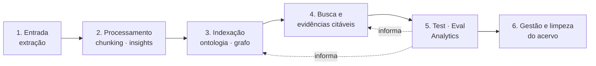

# Um framework para tornar o seu acervo acessível a agentes — e provar que ele está sendo bem usado

> Documento de entrada · setembro de 2026 · o nome ainda não existe
> Versão anterior (biblioteca de retrieval): `rag-vision.v1-retrieval-lib.md`

## A solução em um parágrafo

Todo produto com IA sobre um acervo próprio passa pela mesma pipeline: extrair bem, processar bem, indexar de um jeito que respeite a ontologia do domínio, dar ao agente meios de acesso ao dado, medir o que funcionou, e cuidar do acervo ao longo do tempo. Esse framework **não entrega essa pipeline pronta** — ela é sua, e você já construiu boa parte. O que ele faz é o que content-core, esperanto e ai-prompter fazem nas suas áreas: oferece **um conjunto de políticas bem definidas, numa interface ergonômica e opinionada**, que o seu produto implementa. Por implementar, você ganha capacidades que hoje ninguém tem e todo mundo reconstrói mal: busca que entende a sua ontologia, evidências citáveis, verificação opcional, versionamento, e — o mais importante — **analytics sobre como os agentes acessam o seu dado e o que de fato foi útil**, para que a ontologia e o algoritmo melhorem com o uso.



O princípio que atravessa tudo: **enforçar boas práticas**. Cada bloco abaixo diz qual é o nosso papel nele, o que fazemos por você, o que facilitamos, e o que pedimos em troca.

---

## 1. Qualidade da entrada — extração

**A promessa:** o conteúdo entra do melhor jeito possível.

**Nosso papel:** pequeno, e já resolvido por outra peça. Quem extrai é o **content-core**. O framework não extrai nada.

**O que fazemos por você:** nada aqui diretamente — mas tudo que vem depois depende de a extração preservar *estrutura*: páginas, headings, timestamps, posições. Sem isso, não existe locator, e sem locator não existe citação que um humano consiga abrir.

**O que facilitamos:** o contrato de saída do content-core já carrega o que o framework precisa; se você usa outro extrator, dizemos exatamente quais campos preservar. 

**O que pedimos:** conteúdo extraído com locators preservados. É o único pedido deste bloco.

---

## 2. Qualidade do processamento — chunking e insights

**A promessa:** várias estratégias de chunking, extração de insights, análise e extração de features — a escolha certa por tipo de conteúdo, não uma regra fixa.

**Nosso papel:** oferecer diversidade de estratégias e as práticas que as tornam confiáveis, com integração nativa a LLMs via esperanto e ai-prompter. Não decidimos a sua estratégia; garantimos que qualquer uma delas produza unidades que o resto da pipeline consegue usar.

**O que fazemos por você:** um catálogo de estratégias (chunking por tamanho, por estrutura, contextual, late chunking; insights por LLM; fatos por analyzer) que já saem no formato certo — cada unidade com identidade estável, projeções de texto adequadas (uma para ser encontrada, outra para o modelo entender), locator e a relação **depende de** com a origem.

**O que facilitamos:** trocar de estratégia sem quebrar citações antigas; reprocessar sem perder identidade; medir no bloco 5 qual estratégia funciona melhor para o seu conteúdo em vez de discutir em teoria.

**O que pedimos:** que as suas unidades declarem **quem são** (um id que sobrevive a reprocessamento) e **de onde vieram** (a relação *depende de*). Você decide o quê e como; nós exigimos que isso seja dito.

---

## 3. Qualidade da indexação — entendimento e compiled truth

**A promessa:** organizar de um jeito prático (documento + grafo + vetor), entender e respeitar uma ontologia, otimizar o banco da melhor forma possível.

**Nosso papel:** o de guia de arquitetura — ontologia, desenho de grafo, arquitetura de dados — mais a peça que faz a ontologia ser executável. Cada projeto tem a sua: o Open Notebook tem sources, notebooks, insights, notas e conteúdo extraído; o J tem notícias e entidades com pesos e descrições; a Nord tem palavras-chave, tipos de documento e temas. O framework não impõe uma ontologia; ele pede que você declare a sua.

**O que fazemos por você:** padrões prontos para as três camadas (documento, grafo, vetor) no SurrealDB — índices vetoriais de verdade, full-text configurado, relações de proveniência como arestas — e uma forma declarativa de dizer: estes são meus tipos, estas são as relações entre eles (*depende de*, *menciona*, *pertence a*, *gerado a partir de*), estes são os escopos possíveis, isto é o que envelhece (freshness).

**O que facilitamos:** não errar as três coisas que todo projeto erra — índice vetorial ausente, identidade de unidade que morre no reprocessamento, proveniência que se perde entre a indexação e a resposta.

**O que pedimos:** **a ontologia declarada**. Tipos, relações, escopos, o que é original e o que é derivado, o que tem prazo de validade. É o pedido mais importante de todo o framework — tudo que vem depois lê essa declaração.

---

## 4. Busca e evidências citáveis

**A promessa:** um framework para expor os meios de acesso ao dado de uma forma que complementa a ontologia do projeto — facilitando relevância, freshness, prioridade semântica, grau de confiança, fact-checking e evidence-storage.

**Nosso papel:** este é o coração, e é importante dizer o que ele **não** é: não é um motor de busca pronto que substitui o seu. A estratégia de acesso depende da ontologia. No J, uma pergunta sobre um ministro começa pela entidade e pela vizinhança dela, talvez por uma timeline; uma pergunta sobre três impostos começa por palavra-chave para uma visão a 30 mil pés e depois refina. Na Nord, o copilot navega por temas e tipos de documento. No Open Notebook, o escopo é o notebook, e o agente já deveria ter à mão os descritivos, insights e notas daquele grupo antes de abrir qualquer conteúdo. Cada uma dessas é uma **ferramenta preparada** para o agente — e são diferentes por projeto.

**O que fazemos por você:**
- **Meios de acesso como ferramentas declaradas.** Você expõe as suas estratégias (busca por escopo, navegação por entidade, timeline, palavras-chave com boa cobertura, temas) num formato que qualquer agente — interno, LangGraph, Deep Agent ou um cliente MCP — consome do mesmo jeito. O framework cuida do que é comum: escopo antes do ranking, fusão híbrida (texto + vetor) medida em vez de chutada, freshness como critério de primeira classe, prioridade semântica.
- **Evidência citável em camadas.** A camada mínima é obrigatória e barata: toda resposta sabe *de onde tirou* — "peguei essas informações de tais lugares". A Marilinha só precisa disso. As camadas seguintes são opcionais e ligadas por política: validação estrutural (a evidência citada existe, está no escopo, foi de fato entregue ao modelo) e **fact-checking** — um pipeline que pega cada alegação da resposta, encontra a fonte apontada e confere se ela corrobora, por pós-processamento ou por outro modelo. O J precisa disso: se o agente diz que uma lei está em tal status, tem que provar.
- **Navegação no grafo do SurrealDB** como capacidade de acesso, não só como armazenamento: entidades adjacentes, caminhos de *depende de* até a origem, escopo por relação.
- **Evidence-storage:** o que foi entregue e o que foi citado fica registrado, com versão, para que uma citação possa ser reaberta depois.

**O que facilitamos:** o agente chega ao dado certo com menos tentativas, porque as ferramentas já falam a língua da ontologia; a resposta sai com atribuição sem custo extra; quem precisa de prova forte liga o fact-checking sem reescrever nada; e o caso MCP — onde não sabemos se o agente do outro lado citou — ainda registra o que foi acessado.

**O que pedimos:** duas coisas, e são o contrato mínimo do framework inteiro:
1. **Declare os seus meios de acesso** no formato do framework (o que cada ferramenta recebe, o que devolve, que escopo respeita).
2. **Registre uso e citação.** Toda vez que uma resposta usa ou menciona um conteúdo, o link mensagem ↔ conteúdo vai para o banco, no formato comum. Isso é a evidência mínima e é a matéria-prima do bloco 5.

---

## 5. Test, eval e analytics

**A promessa:** saber o que está funcionando — e usar isso para melhorar.

**Nosso papel:** fechar o loop. Este bloco é o que transforma o framework de "conjunto de boas práticas" em "sistema que aprende com o uso". E é o bloco que ninguém constrói, porque exige que os blocos 3 e 4 tenham gerado o rastro certo.

**O que fazemos por você:**
- **Analytics de acesso:** das formas de acesso que você disponibilizou, quais os assistentes estão usando? Quais estão funcionando — no sentido de serem citadas ou consideradas úteis? Quais nunca são chamadas? Essa é a análise que diz onde mexer na ontologia ou na estrutura do dado para servir o assistente melhor da próxima vez.
- **Eval na mesma régua para todos os consumidores:** recall@k e MRR sobre golden sets; faithfulness e atribuição de citações; juiz com rubrica calibrada. O mesmo harness que hoje existe em cinco versões que não conversam entre si.
- **Debug:** reconstruir o que o agente viu, pediu, abriu e citou numa conversa específica.
- **Alimentação de testes:** os links de uso e citação do bloco 4 viram casos de teste e regressão sem esforço de anotação.

**O que facilitamos:** decisões que hoje são chute — qual fusão, qual chunking, qual estratégia de acesso, se contextual retrieval compensa — passam a ser medidas. E o agente enriquece a base ao trabalhar: pelas notas que cria e pelo rastro que deixa.

**O que pedimos:** um conjunto pequeno de perguntas reais com respostas esperadas (o golden set), e que o registro do bloco 4 esteja ligado. O resto vem de graça.

---

## 6. Gestão e limpeza do acervo

**A promessa:** o acervo muda, e nada que foi citado se perde por isso.

**Nosso papel:** dar as práticas de versionamento e retenção, e deixar que o dono do ambiente escolha a política.

**O que fazemos por você:**
- **Banco baseado em versões, não em substituição.** Uma nova versão de uma source leva a novas versões dos insights que dependem dela; as versões anteriores viram somente-leitura. Elas só importam se foram apontadas enquanto estavam ativas — mas, se foram, o conteúdo delas está lá.
- **Regeneração dirigida por dependência.** *Depende de* e *menciona* são relações diferentes: o que depende pode ser regenerado quando a origem muda; o que menciona tem vida própria e só referencia. O framework sabe a diferença e oferece a regeneração dos dependentes como operação.
- **Limpeza segura:** o que nunca foi citado pode ser coletado; o que foi, fica retido enquanto houver quem dependa — com TTLs e políticas de exclusão configuráveis, porque privacidade e custo local importam.

**O que facilitamos:** auditar depois — "esta resposta de março citou esta versão deste documento" — sem guardar tudo para sempre.

**O que pedimos:** a política. Você diz se quer preservar as referências citadas e as versões originais, por quanto tempo, e o que pode ser apagado. O framework aplica; a decisão é sua.

---

## O que isso não é

- **Não é um serviço hospedado fora da sua aplicação.** Roda dentro dela, no seu SurrealDB.
- **Não substitui o que você já construiu.** Complementa a sua ontologia e as suas estratégias; não as troca.
- **Não é um motor de busca pronto.** É a forma de expor as suas buscas — e de descobrir quais valem a pena.
- **Não impõe uma ontologia, um chunking, um framework de agentes ou um LLM.**

## O que pedimos, em resumo

| Bloco | O pedido |
|---|---|
| 1. Entrada | locators preservados na extração |
| 2. Processamento | unidades com id estável e relação *depende de* |
| 3. Indexação | **a ontologia declarada** |
| 4. Busca e evidências | **meios de acesso declarados** + **registro de uso e citação** |
| 5. Eval e analytics | um golden set pequeno |
| 6. Gestão do acervo | a política de versionamento e retenção |

Os dois em negrito são o contrato mínimo. Tudo o mais é capacidade que você liga por cima.

---

# Parte 2 — O que isso é, tecnicamente

A história acima é a proposta de valor. Daqui para baixo é o que o time constrói.

## O que é, em uma frase

Um **pacote Python async, SurrealDB-first**, que roda dentro do processo da sua aplicação e entrega três coisas: **contratos** (o que você declara e implementa), **capacidades** (o que você liga por cima) e **um inspector** (o que diz se você está aderente). Não há serviço, não há daemon, não há banco próprio — há tabelas próprias no seu SurrealDB.

```text
┌──────────────────────────── sua aplicação ────────────────────────────┐
│  domínio · runtimes de agente · UI · API                              │
│        │ implementa                         ▲ consome                  │
│  ┌─────▼──────────────────┐     ┌──────────┴─────────────────────┐    │
│  │ CONTRATOS               │     │ CAPACIDADES (opt-in)            │    │
│  │ Ontology · Unit         │────▶│ search · evidence · versioning  │    │
│  │ AccessTool · Usage      │     │ eval · analytics · doctor       │    │
│  └─────┬──────────────────┘     └──────────┬─────────────────────┘    │
│        │                                    │                          │
│  ┌─────▼────────────────────────────────────▼───────────────────────┐  │
│  │ pacotes da casa: esperanto · ai-prompter · content-core ·        │  │
│  │ surreal-commands · (surreal-basics)                              │  │
│  └──────────────────────────────┬───────────────────────────────────┘  │
└─────────────────────────────────┼──────────────────────────────────────┘
                                  ▼
                      SurrealDB (suas tabelas + tabelas do framework)
```

## O que delegamos aos pacotes da casa

O framework é deliberadamente magro. Tudo que já existe na casa é consumido, não reimplementado.

| Responsabilidade | Pacote | O que o framework faz com ele |
|---|---|---|
| Extração de conteúdo com estrutura (páginas, headings, timestamps) | **content-core** | consome o `ExtractionOutput`; define quais campos viram `Locator`. Não é dependência obrigatória — quem extrai de outro jeito entrega o mesmo shape |
| Embeddings e reranking, com o conhecimento por provider (task_type, batch, quirks) | **esperanto** | única dependência para vetores. O framework grava o `embedding_config_hash` por índice e falha alto em drift |
| Chamadas de LLM para insights, transformations, fact-check | **esperanto** | o framework **não escolhe nem configura modelo**; recebe uma instância de modelo da aplicação (as credenciais são dela) e chama |
| Templates de prompt das estratégias LLM (insight, resumo contextual, fact-check) | **ai-prompter** | templates versionados e sobrescrevíveis pela aplicação; a versão do template entra no id da unidade derivada |
| Jobs assíncronos: indexação, reindexação, regeneração de dependentes, runs de eval | **surreal-commands** | o framework expõe *comandos*; a aplicação os registra no worker dela. Nada roda em background por conta própria |
| Acesso ao SurrealDB, migrations das tabelas do framework | **surreal-basics** (quando pronto) ou o driver oficial | as tabelas do framework têm migrations próprias, aplicadas pelo mecanismo da aplicação |
| Geração de artifacts (podcast, etc.) | podcast-creator e afins | fora do framework; eles são *consumidores* (declaram unidades e registram uso) |

Regra: **nenhum import de framework de orquestração** (LangGraph, Pydantic AI, Deep Agents). Adapters para LangChain tools e MCP são exemplos no repo, não dependências.

## Como expomos as tools de chunking e de insights

Bloco 2 na prática: um **catálogo de estratégias** registradas por nome, cada uma implementando um protocolo pequeno, e a ontologia dizendo qual estratégia serve qual tipo de conteúdo.

```python
class ChunkingStrategy(Protocol):
    name: str; version: str
    def split(self, extracted: Extracted) -> list[Unit]: ...

class DerivationStrategy(Protocol):          # insights, resumos, transformations
    name: str; version: str
    async def derive(self, source: Unit | Extracted, model: LanguageModel) -> list[Unit]: ...

class ComputeStrategy(Protocol):             # fatos computados
    name: str; version: str
    def compute(self, inputs: Any) -> list[Unit]: ...
```

- Estratégias LLM recebem o **modelo do esperanto** já configurado pela aplicação e usam **templates do ai-prompter** (sobrescrevíveis). O framework nunca vê uma chave de API.
- Toda estratégia devolve `Unit`s **no formato certo por construção**: id estável (o par `strategy@version` entra no hash), as projeções de texto, o locator herdado do input e a relação *depende de* apontando para a origem. É por isso que trocar de estratégia não quebra citações antigas — a versão anterior das unidades continua existindo com o id antigo.
- O catálogo inicial: chunking por tamanho (o do Open Notebook), por estrutura (headings/seções via content-core), contextual (prefixo gerado por LLM, versionado), late chunking (quando o modelo de embedding for long-context); derivação de insight por template; resumo de documento; fatos por analyzer (o consumidor traz o analyzer, o framework traz o contrato).
- A aplicação pode registrar as próprias estratégias. O que ela não pode é devolver algo que não seja `Unit`.

## O design pattern para enforçar boas práticas

Quatro mecanismos, do mais duro ao mais suave. É a mesma receita do esperanto (interface de provider) e do content-core (contrato de saída), aplicada a mais lugares.

1. **Portas e adaptadores (hexagonal), com o contrato como tipo.** A aplicação implementa protocolos (`Ontology`, `Unit`, `AccessTool`, `Verifier`); as capacidades só aceitam objetos que satisfazem o protocolo. Não dá para chamar `search()` sem uma ontologia validada, nem registrar uma tool sem declarar escopo. A prática é imposta pelo tipo, não pela documentação.
2. **Registries explícitos.** Estratégias, meios de acesso, verifiers e políticas são registrados por nome, com versão. O registro valida na hora (id estável? locator presente? escopo declarado?) e recusa o que não cumpre. Nada é descoberto por mágica.
3. **Políticas como objetos, não como condicionais.** Elegibilidade de derivados, camadas de evidência, retenção de versões, freshness: cada uma é um objeto declarado uma vez (`EvidencePolicy`, `RetentionPolicy`, `FreshnessPolicy`) e lido por todas as capacidades. Sem `if projeto == "J"` espalhado.
4. **Instrumentação por decorator + `doctor`.** Todo meio de acesso passa por um wrapper que valida o escopo, normaliza o retorno para referências e **registra o uso** — o desenvolvedor não precisa lembrar de logar. E um comando `doctor` inspeciona a declaração e o banco e responde: índice vetorial existe? ids são estáveis (amostra reprocessada bate)? proveniência chega até a origem? uso e citação estão sendo registrados? golden set existe? É o "enforça boas práticas" em forma de relatório, rodável no CI.

Três níveis de imposição, para ser honesto sobre o que é duro e o que é conselho: **tipo** (impossível sem), **registro** (recusado na hora), **doctor** (avisado).

## O que é, na prática, definir a ontologia

Um objeto Python declarativo, validado no startup, exportável como JSON para o inspector e para documentação. Ele mapeia **as tabelas que você já tem** para o vocabulário do framework — o framework lê de onde os dados estão e materializa a própria projeção de índice (tabelas próprias, nunca escreve nas suas).

```python
ontology = Ontology(
    types=[
        UnitType("passage",  table="source_embedding", nature="original",
                 id=StableId.of("source", "text_version", "chunker", "order"),
                 text=Field("content"), context=Render(with_neighbors),
                 locator=Locator(source="source", order="order", heading="heading"),
                 verifier=QuoteMatch(source_text="source.full_text")),
        UnitType("insight",  table="source_insight", nature="derived",
                 text=Field("content"), verifier=DerivationIntact(version="pipeline_version")),
        UnitType("note",     table="note", nature="authored", text=Fields("title", "content")),
        UnitType("entity",   table="entity", nature="original",
                 text=Render(entity_card), verifier=Exists()),          # exemplo J
        UnitType("fact",     table="fact", nature="computed",
                 text=Render(fact_sentence), verifier=Recompute(analyzer)),  # exemplo Smart Fit
    ],
    relations=[
        Relation("depends_on", "insight", "source"),
        Relation("mentions",   "note", ["source", "note"]),
        Relation("belongs_to", "source", "notebook"),
        Relation("about",      "news", "entity", weight="weight"),   # exemplo J
    ],
    scopes=[Scope("notebook", via="belongs_to"), Scope("source"), Scope("entity", via="about")],
    freshness=[Freshness("news", field="published_at", decay="30d")],
    policy=EligibilityPolicy(factual_default=["passage", "fact"], derived_as_breadcrumb=True),
)
```

O que cada parte significa:

- **`UnitType`** — um tipo do seu domínio que pode ser encontrado. Diz onde mora (tabela), a natureza epistêmica (original / derivado / autoral / computado), como se gera o **id estável**, de onde vem o **texto para ser encontrado** (campo ou renderer, quando o texto é computado), o **locator**, e o **verifier** — que é o que torna a verificação polimórfica: cada tipo diz como se prova.
- **`Relation`** — as arestas que existem no seu grafo, nomeadas no vocabulário comum. *depends_on* e *mentions* são as duas que todo projeto tem; o resto é seu.
- **`Scope`** — por onde se recorta uma busca. Escopo é filtro opaco: o framework aplica antes do ranking e não interpreta.
- **`Freshness`** — o que envelhece e como. Para o J, uma notícia de 2019 sobre uma lei perde para a de ontem, e isso é critério de ranking, não pós-filtro.
- **`EligibilityPolicy`** — o que pode sustentar um claim por default. O Open Notebook diz "passagens e fatos"; um produto de corpus inteiramente derivado diz "insights".

Definir a ontologia é, na prática, **escrever esse objeto e rodar `doctor`**. O resultado do doctor é a lista do que falta para ficar aderente.

## Meios de acesso como ferramentas declaradas

Bloco 4, contrato mínimo #1. As suas estratégias de acesso são funções suas, decoradas:

```python
@access_tool(name="entity_neighbors", scope="entity", returns=Refs)
async def entity_neighbors(entity_id: str, hops: int = 1) -> list[Ref]:
    ...  # sua query no grafo

@access_tool(name="keyword_overview", scope="notebook", returns=Candidates)
async def keyword_overview(terms: list[str], scope: ScopeValue) -> list[Candidate]:
    ...  # sua busca de cobertura a 30 mil pés

@access_tool(name="notebook_briefing", scope="notebook", returns=Units)
async def notebook_briefing(notebook_id: str) -> list[Unit]:
    ...  # descritivos, insights e notas do notebook, antes de abrir qualquer conteúdo
```

O decorator faz o que é comum: valida o escopo contra a ontologia, normaliza o retorno para **referências** (candidato, unidade ou receipt — sempre com id e tipo), registra o evento de acesso, e publica a tool no registry. Do registry saem, sem código adicional, as versões LangChain e MCP.

O framework traz **tools de fábrica** sobre a projeção de índice — `search` (híbrida, com escopo, freshness e fusão configurável), `open` (candidato → receipt), `trace` (caminhar *depends_on* até a origem), `neighbors` (grafo) — que você pode usar como estão, compor nas suas, ou ignorar. Elas existem para que o caso comum não exija código; não para substituir as suas.

## Registro de uso e citação

Bloco 4, contrato mínimo #2 — e a matéria-prima do bloco 5. Duas tabelas do framework:

- **`access_event`** — quem chamou qual tool, com que argumentos e escopo, o que voltou (referências), em qual `run_id`. Gravado pelo decorator; você não escreve nada.
- **`use_link`** — mensagem/resposta → unidade, com o tipo do vínculo: `delivered` (foi para o prompt), `cited` (apareceu na resposta), `useful` (marcado por humano ou por avaliação). Gravado por `record_usage(response, delivered=..., cited=...)` no seu runtime, ou pelo helper `cite()` quando a resposta é estruturada.

No caso MCP, `access_event` existe e `use_link.cited` não — e o analytics diz isso com clareza em vez de fingir cobertura.

## Evidência e verificação como capacidades opt-in

Uma política por projeto, lida por todas as capacidades:

```python
EvidencePolicy(
    attribution="always",                       # camada mínima: sempre
    structural=True,                            # existe · escopo · versão · foi entregue
    fact_check=FactCheck(verifier="hhem", threshold=0.6, on_fail="mark"),   # ou None
    retention=Retention(keep_cited_versions=True, ttl_uncited="90d"),       # ou None
)
```

`on_fail="mark"` é o default e não é negociável quando o fact-check está ligado: falha sinaliza a citação, nunca a remove em silêncio. O verifier semântico é plugável (HHEM local por default; MiniCheck; um LLM via esperanto) e rotulado como *verified*, distinto de *cited*.

## Versionamento e regeneração

Bloco 6. As tabelas do framework guardam **revisões**, não substituições: uma nova versão de uma unidade original marca a anterior como somente-leitura e dispara, via surreal-commands, o job de regeneração dos dependentes (`depends_on`), que ganham novas versões por sua vez. O que `mentions` continua apontando para onde apontava. A limpeza percorre `use_link`: sem citação, coletável conforme o TTL; com citação, retido. Auditoria é uma query: "esta resposta citou qual versão de quê".

## Eval e analytics

Bloco 5. Dois pacotes irmãos sobre as mesmas tabelas:

- **`eval`** — golden sets (gerados com validação programática + juiz calibrado), recall@k / MRR / nDCG sobre as tools de acesso, métricas de citação (recall e precisão à la ALCE), comparação entre estratégias e entre fusões. Roda como comando.
- **`analytics`** — consultas prontas sobre `access_event` e `use_link`: uso por tool, taxa de citação por tool, unidades nunca acessadas, tipos que mais sustentam respostas, latência por meio de acesso. É a resposta a "das formas de acesso que eu disponibilizei, quais estão sendo usadas e quais têm funcionado".

## Ordem de construção (v0)

Do contrato para as capacidades, com o Open Notebook e o Smart Fit como consumidores de referência:

1. **Contratos + ontologia + `doctor`** — declarar, validar, inspecionar. Sem isso nada mais existe.
2. **Registro de uso e citação + `analytics` básico** — o loop de feedback nasce antes do motor de busca, porque é ele que vai dizer se o motor está bom.
3. **`access_tool` + registry + adapters (LangChain, MCP)** — as tools de fábrica `search`/`open`/`trace` sobre a projeção de índice, com fusão nativa do SurrealDB.
4. **Evidência estrutural** — receipts, entrega verificada, `cite()`.
5. **Catálogo de estratégias** (bloco 2) — começando pelas que o Open Notebook e o Smart Fit já têm.
6. **Versionamento e regeneração** (bloco 6).
7. **Fact-check plugável** e **`eval`** completo.

O `eval` mínimo (recall@k sobre um golden set) entra junto com o passo 3 — nenhuma fusão ou estratégia é escolhida sem ele.
