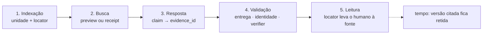
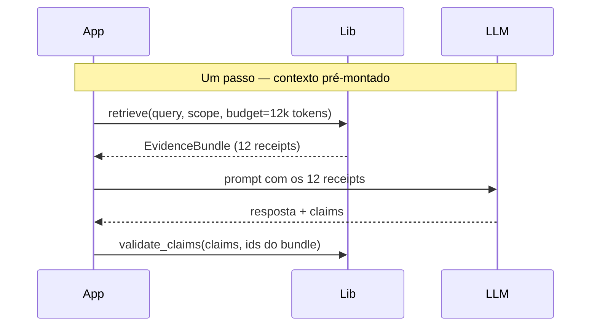
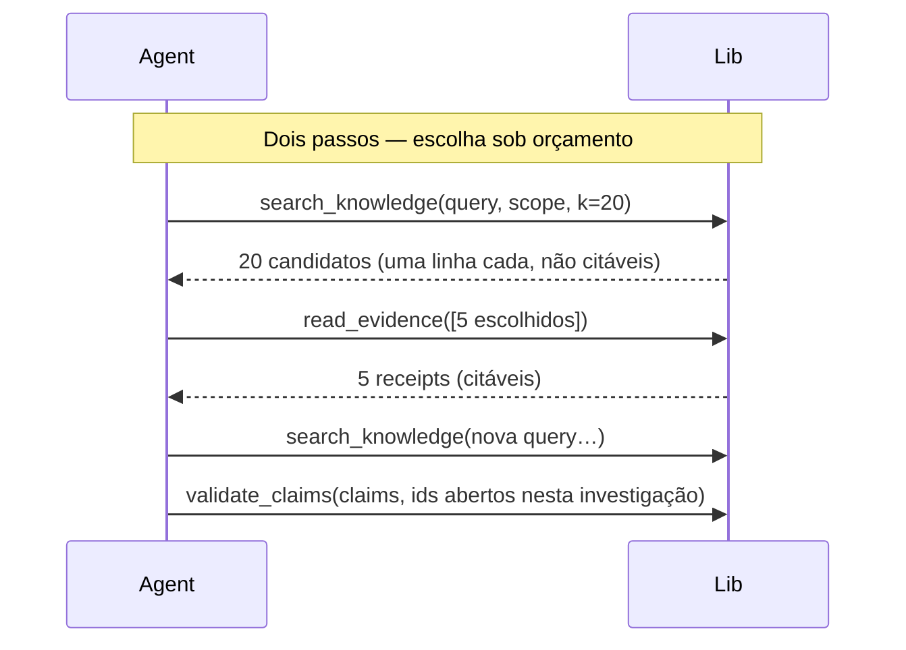

# Uma biblioteca de retrieval com evidências

> Versão pocket · setembro de 2026 · o nome ainda não existe

## O que é

Uma biblioteca Python, open source, que faz a parte do RAG que todo mundo erra: **encontrar, citar e provar**.

Você entrega o seu conteúdo — do jeito que ele é: chunks de documentos, insights gerados por LLM, fatos computados por um analyzer — e ela devolve busca híbrida com escopo, evidências com identidade estável e uma validação que responde à pergunta que ninguém responde hoje: *essa citação corresponde a algo real?*

Ela não é um framework de agentes, não é um chatbot e não gera texto. É a fundação por baixo disso tudo. O agente, o chat e a interface são seus.

Nasceu de um padrão que a Supernova já validou cinco vezes — esperanto, ai-prompter, content-core, surreal-commands, podcast-creator: extrair de projetos reais, depois do uso, com consumidores esperando. Sete projetos foram lidos; o mesmo conhecimento tinha sido descoberto e perdido em cada um deles.

## Como funciona

Quatro ideias sustentam tudo.

**1. A unidade de retrieval é um protocolo, não um chunk.**
Você diz o que a sua unidade *é*; a biblioteca só precisa saber cinco coisas sobre ela:

```python
class RetrievalUnit(Protocol):
    id: str                    # estável — sobrevive a re-embedding e reprocessamento
    text_for_embedding: str    # otimizado para ser encontrado
    text_for_context: str      # otimizado para o modelo entender
    locator: Locator           # como o humano chega até aqui: source, trecho, página, ordem
    provenance: Provenance     # de onde veio, e se é original, derivado ou autoral
    scope_keys: dict           # filtros que só você interpreta
```

Um chunk de PDF, um insight extraído por LLM e um número calculado a partir de uma tabela satisfazem o mesmo protocolo sem se converter um no outro.

Repare que a unidade **não** carrega uma citação: carrega o *locator* — o endereço que existe desde a indexação e que uma citação vai usar depois. A citação em si só nasce na hora da resposta, quando um claim aponta para uma evidência (`claim → evidence_id`); é ela que a validação verifica.

**2. O que o modelo cita é sempre um *receipt*.**
Um receipt é a evidência com identidade: texto completo da unidade, locator, versão e hash — o que permite verificar depois. O que **não** é citável é um preview: o trecho curto com score que uma busca devolve para alguém escolher.

Isso não obriga dois passos. Quando o orçamento permite mandar tudo — contexto pré-montado, modelos com janela grande —, `retrieve()` busca e abre de uma vez e devolve um `EvidenceBundle` de receipts prontos para o prompt. O caminho em dois passos (`search_knowledge` → candidatos compactos → `read_evidence` nos escolhidos) existe para o agente que precisa decidir sob orçamento: vinte candidatos de uma linha cabem onde vinte documentos não cabem. Nos dois caminhos vale a mesma regra: só entra numa citação o que chegou ao modelo como receipt, nunca o preview.

**3. Verificação é polimórfica e está no caminho padrão.**
Não se verifica um fato do mesmo jeito que se verifica um trecho:

| Unidade | Verifier | Pergunta que responde |
|---|---|---|
| chunk | `QuoteMatch` | o trecho citado existe literalmente na fonte? |
| insight derivado | `DerivationIntact` | a fonte existe e a versão bate com o pipeline? |
| fato computado | `Recompute` | recalcular dá o mesmo valor? |

`validate_claims(claims, evidence_ids)` roda por padrão e devolve um relatório. Falha é **marcada**, não descartada — a resposta sai com a citação sinalizada, não silenciosamente sem ela.

**4. Opinião forte em três lugares, e só neles.**
Provider de embedding (o conhecimento de configuração fica codificado — `task_type` do Gemini muda a precisão em 2,7×), SurrealDB como índice (com índice vetorial de verdade, não full scan) e evidência verificável por default. Em todo o resto — framework de orquestração, LLM de geração, chunking, single ou multi-user — ela é silenciosa de propósito.

## As duas dinâmicas em detalhe

### A. Do locator à citação: o ciclo de vida

Uma citação passa por cinco momentos, e cada um tem um dono diferente. O erro clássico é misturá-los — pedir ao modelo que "cite" quando o sistema nunca registrou o que entregou a ele.



| Momento | O que existe | Quem produz |
|---|---|---|
| **1. Indexação** | a unidade com `id` estável e `locator` (source, trecho, página, ordem). Ainda não há citação — há um *endereço* | o seu adapter |
| **2. Busca** | preview (candidato, não citável) ou receipt (texto completo + locator + versão + hash, citável) | a biblioteca |
| **3. Resposta** | `{claim, evidence_ids}` — a citação nasce aqui, como estrutura, não como texto no markdown | o seu runtime + o modelo |
| **4. Validação** | relatório claim a claim: a evidência foi **entregue** a esta geração? o id existe e está no escopo? a versão bate? o verifier do tipo passa? | a biblioteca |
| **5. Leitura** | o locator vira link, destaque, página, timestamp — o humano confere | a sua UI |

Duas consequências práticas:

- **"Entregue" é verificável porque a biblioteca registra o que saiu.** Tanto `retrieve()` quanto `read_evidence()` devolvem receipts com identidade; a validação confere que o `evidence_id` citado está entre os que aquela geração recebeu. Um id válido que o modelo "lembrou" de outra conversa falha aqui — e é marcado, não removido.
- **O locator é estável; a versão é o que muda.** Se a source for reprocessada, a unidade mantém o `id`, ganha uma nova versão, e a versão citada fica retida enquanto houver uma resposta que dependa dela. A citação de ontem continua abrindo o trecho de ontem.

### B. Um passo ou dois: quem decide é o orçamento

A pergunta não é "abrir antes de citar?" — é "quantos receipts cabem no que o modelo vai receber?". A biblioteca oferece os dois caminhos sobre o mesmo índice, os mesmos receipts e a mesma validação.





| Situação | Caminho | Por quê |
|---|---|---|
| Chat de notebook com `Auto`, modelo local sem tool calling | um passo | uma única chamada; o orçamento de contexto decide quantos receipts entram |
| Source chat em documento que cabe inteiro | um passo (ou nem retrieval: full text é o receipt) | não há o que escolher |
| Modelo com janela grande e corpus pequeno | um passo | mandar tudo é mais barato do que decidir |
| Deep research em notebook com centenas de sources | dois passos | vinte candidatos de uma linha cabem onde vinte documentos não cabem; o agente refina e busca de novo |
| Agente externo via MCP | dois passos | o cliente planeja; a biblioteca só entrega o que foi pedido, e registra |

O que **não** muda entre os caminhos: só receipts entram numa citação; a validação confere a entrega nos dois; a qualidade da citação não depende do modo — só o esforço gasto para encontrar e confrontar evidências.

**Exemplo.** Um notebook com 40 papers; a pergunta é "o que a evidência diz sobre X?". Em modo focado, `retrieve()` devolve os 12 receipts que cabem em 12k tokens; o modelo responde com 6 claims; a validação confirma 5 entregues e íntegras e marca 1 cujo `evidence_id` não estava no bundle — a UI mostra a resposta com esse claim sinalizado. Em modo profundo, o agente pede 20 candidatos, abre 5, percebe uma lacuna sobre um subtema, busca de novo, abre mais 3, e responde; a validação confere contra os 8 abertos naquela investigação. Mesmo índice, mesmos receipts, mesma régua.

## Como você conecta com a sua app

Três passos, sem reescrever nada.

**1. Declare a sua ontologia.** Quais são os seus tipos de unidade, como cada um se verifica, quais relações de proveniência existem entre eles, e qual é a sua política: derivados podem sustentar um claim? Por default, sim ou não? Isso é seu, não da biblioteca — o Open Notebook diz "derivado nunca é evidência factual"; um produto cujo corpus inteiro é derivado diz o contrário. Os dois funcionam.

**2. Registre um adapter por tipo e empurre unidades quando algo muda.** A ontologia vira código: cada tipo tem um adapter com `kind`, o verifier, uma função `to_unit()` do seu objeto de domínio para `RetrievalUnit`, e um callback de resolução que só a verificação usa.

```python
class PassageAdapter(UnitAdapter):
    kind = "passage"
    verifier = QuoteMatch()

    def to_unit(self, chunk) -> RetrievalUnit:
        return RetrievalUnit(
            id=stable_id(chunk.source_id, chunk.text_version, chunk.chunker_version, chunk.order),
            text_for_embedding=chunk.text,
            text_for_context=chunk.text_with_neighbors(),
            locator=Locator(source=chunk.source_id, span=chunk.span, order=chunk.order),
            provenance=Provenance(kind="original", parents=[chunk.source_id], pipeline_version="chunker@3"),
            scope_keys={"notebook_ids": chunk.notebook_ids, "source_id": chunk.source_id},
        )

    async def load_source_text(self, locator) -> str:      # só o verifier chama
        return (await Source.get(locator.source)).full_text

registry.register(PassageAdapter(), NoteAdapter(), InsightAdapter(), ArtifactUnitAdapter())
```

A indexação é **push, explícita**: a sua app chama a biblioteca quando ela já sabe que algo mudou — a biblioteca não observa o seu banco.

```python
await index.upsert([PassageAdapter().to_unit(c) for c in chunks])   # source processada
await index.upsert([NoteAdapter().to_unit(note)])                   # nota salva
await index.delete(scope={"source_id": source.id})                  # source removida
await index.rebuild(kind="passage", source=PassageAdapter().iter_all())  # troca de embedding, migração
```

O upsert é por `id` estável: mesmo texto e mesmo chunker geram os mesmos ids, então reprocessar só re-embeda se o modelo de embedding mudou; texto novo gera id novo e a versão anterior fica retida se houver citação dependente. A biblioteca guarda a sua própria cópia da unidade (projeções, locator, proveniência, escopo, vetor) em tabelas próprias — por isso a busca devolve receipts sem voltar na sua app; a única volta é na verificação (`load_source_text` para o `QuoteMatch`, o seu analyzer para o `Recompute`). Esquecer de indexar é custo seu; `rebuild` idempotente é a rede de segurança. A biblioteca não chunka por você; se quiser, o chunker é utilitário opcional.

**3. Use as funções.** Async, sem framework:

```python
# contexto pré-montado: busca + abre de uma vez
bundle     = await retrieve(query, scope=Scope(notebook_ids=[...]), budget=Budget(context_tokens=12_000))

# agente sob orçamento: escolhe antes de abrir
candidates = await search_knowledge(query, scope=Scope(notebook_ids=[...]), budget=Budget(k=20))
evidence   = await read_evidence([c.id for c in chosen])

# em ambos: validar o que foi citado
report     = await validate_claims(answer.claims, evidence_ids=[e.id for e in evidence])
```

As mesmas funções servem uma chamada única com contexto pré-montado, um deep agent iterativo e um servidor MCP consumido por um agente externo. Embrulhá-las como tools do LangChain ou do MCP é uma dúzia de linhas — sua, não nossa.

Ela mora no mesmo SurrealDB da sua aplicação, em tabelas próprias, para que a proveniência aponte para os seus registros sem cópia. Embedding e rerank passam pelo esperanto; o LLM que gera a resposta é problema seu, com qualquer framework.

## O que ela te permite fazer

- **Busca híbrida com escopo, de verdade.** BM25 + vetorial + fusão medida (não escolhida por preferência), filtro de escopo antes do ranking, índice vetorial que escala para milhares de documentos. Sem embeddings? Degrada para texto e continua funcionando.
- **Citações que sobrevivem.** Identidade estável significa que reprocessar ou trocar o modelo de embedding não quebra uma citação feita ontem. Versões citadas ficam retidas enquanto houver quem dependa delas.
- **Respostas verificáveis por construção.** O relatório de validação diz, claim por claim, se a evidência existe, está no escopo, corresponde à fonte e foi de fato entregue ao modelo naquela geração. "Cited" é determinístico; "verified" (semântico, com modelo) é opcional e rotulado.
- **Caminhar do derivado até a origem.** Um resumo, uma nota ou um podcast encontrado na busca leva à passagem original quando ela existe. Conteúdo gerado vira memória pesquisável sem esconder que é gerado.
- **Usar conteúdo antes de adotá-lo.** Um resultado da web ou de uma biblioteca conectada pode ser buscado, usado e citado com um receipt mínimo, sem ingestão. Adotar é decisão do usuário.
- **Medir antes de mudar.** Um pacote irmão de avaliação — recall@k, golden datasets em estágios, juiz e rubrica — na mesma régua para todos os consumidores. Uma melhoria num produto deixa de ser uma regressão silenciosa em outro.
- **Trocar o reasoning de lugar.** O mesmo núcleo serve uma resposta local e barata, uma investigação agêntica profunda e um agente externo via MCP usando a assinatura do usuário. O que muda é o esforço permitido para encontrar e confrontar evidências — não a qualidade da citação.

---

*O que ela não te permite fazer, de propósito: rodar sem SurrealDB, esconder que um conteúdo é derivado, ou tratar um id válido escrito pelo modelo como prova de que a citação está certa.*
